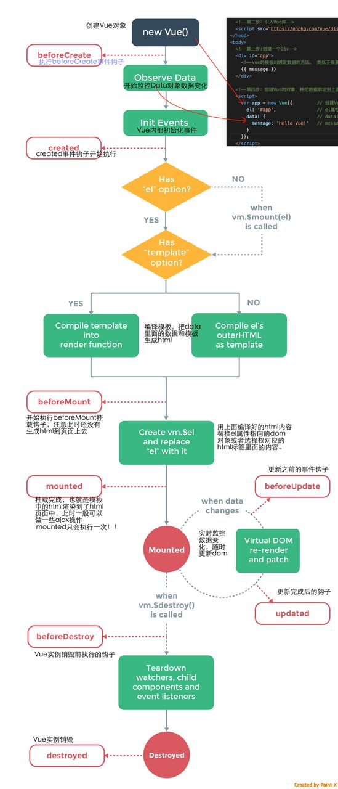

# vue生命周期
vue提供很多钩子。比较常见的有生命周期钩子，生命周期是vue执行的关键。
## 生命周期图

## 生命周期的解析
beforeCreate 和 created 的 $el 是undefined，所以 **beforeCreate** 和 **created** 阶段是不能进行dom操作的，因为拿不到 dom 节点。

brforeMount 时，$el变成了我们写在 html 中 div 节点。

mounted 时， $el变成了 template 中的html，说明覆盖了html原来的 div 节点。

mounted之后，我们调用的所有生命周期方法，拿到的节点，都是渲染之后的节点。
- ajax请求最好放在created里面，因为此时已经可以访问this了，请求到数据就可以直接放在data里面。
- 关于dom的操作要放在mounted里面，在mounted前面访问dom会是undefined。
- 每次进入/离开组件都要做一些事情，用什么钩子：
- 不缓存：

    进入的时候可以用created和mounted钩子，离开的时候用beforeDestory和destroyed钩子,beforeDestory可以访问this，destroyed不可以访问this。
- 缓存了组件：

    缓存了组件之后，再次进入组件不会触发beforeCreate、created 、beforeMount、 mounted，如果你想每次进入组件都做一些事情的话，你可以放在activated进入缓存组件的钩子中。
同理：离开缓存组件的时候，beforeDestroy和destroyed并不会触发，可以使用deactivated离开缓存组件的钩子来代替。