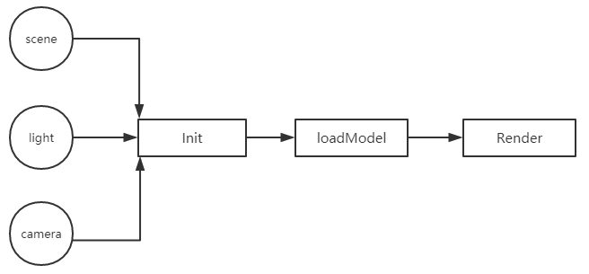
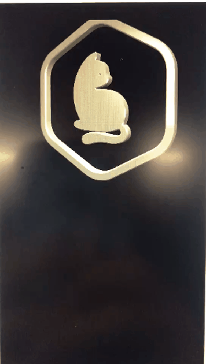
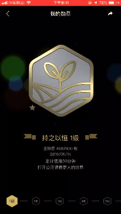

# 网易公开课Three.js实践 - 勋章系统
## 前言
**WebGL**是一种3D绘图协议，这种绘图协议允许javascript和openGL结合起来。WebGL可以为canvas提供3d硬件加速（使用GPU在浏览器渲染3d模型和场景）。既然WebGL是openGL的一种实现，即可以在兼容的浏览器中进行3d渲染，由于浏览器的跨平台性，可以在多个设备多个平台展示3d效果。我们可以用WebGL做什么呢？
> 1. - 数据可视化
> 2. - ar vr
> 3. - 3d游戏动画等
在现代前端技术发展中，使用WebGL创建3d效果是一种不可获取的能力。由于webGL本身api是绘制最普通的点、线、三角形，所以为了绘制大型场景和模型，我们需要选用一些框架帮助开发，比如three.js。

**Three.js**是对WebGL的API抽象化和封装化的js库，不必关心WebGL怎么渲染3d图形，并且在渲染中加入了各种优化，提高了性能。Three.js包含数学库，支持交互，扩展性强，还可以进行SVG,CSS3D等渲染，在WebGL不兼容的版本可以有回退解决方案。下图是three.js对WebGL做的封装:


## 勋章系统设计
 #### 勋章系统开发选型

勋章系统是对用户粘性提升的一种积极刺激行为，分为样式展示(简单图片)--行为触发(达到某种条件)--颁发勋章(提供3d勋章)--勋章升级(不同等级勋章提供不同展示)--趣味性(移动端控制旋转特效)的一种逻辑。在勋章系统中有几个重点:
- 1.**技术选型** 因为是在app中展示，要考虑安卓和ios的差异性，还需要在web端展示效果，最好的选择就是用前端的WebGL方式来做3d勋章系统。在框架选择中，three.js的兼容性功能性都是接受过业界选择的，我们选择了three.js当我们的勋章系统框架。
- 2.**模型选择** 既然是3d勋章，3d模型的选择影响开发周期和渲染效果，调研了3d模型格式：

Three.JS支持格式| 特点 | 优缺点
---|--- |---
JSON（*.js/ *.json） | 专门为Three.js自己设计的JSON格式，你可以使用它以声明的方式定义模型，及模型材质和动画。 | 在app中的webview解析json比较慢
OBJ和MTL（*.obj/ *.mtl） | OBJ是一种简单的三维文件格式，只用来定义对象的几何体。| 对象不支持动画，还需要搭配mtl来载入材质
Collada (*.dae)  | 用来定义XML类文件中数字内容的格式。差不多所有的三维软件和渲染引擎都支持这个格式。 | 使用最广，兼容性好
STL (*.stl) | 立体成型术 。 广泛用于快速成型。 | 生成速度快，但是一般是3d打印机使用
FBX (*.fbx) | 在max、maya、softimage等软件间进行模型、材质、动作和摄影机信息的互导，复用性比较好。 | 多平台支持，但是生成在部分平台会被转为mesh
CTM (*.ctm) | 由openCTM创建的格式。可以用来压缩存储表示三维网格的三角形面片。| 文件压缩效果好，压缩算法理解难度较高
VTK（*.vtk） | Visualization Tookit定义的文件格式，用来指定顶点和面。 | 可支持节点比较多，但threejs仅支持旧格式
PLY (*.ply) | 多边形文件格式。 | 3d打印机使用

加上ui组使用c4d软件，最终选择了以xml为基础的dae的3d模型。
#### 运行Three.js
  Three.js是3d渲染，在3d渲染编程中包括：场景，相机，渲染器（物体，光源，纹理）。下图是three.js的运行过程：
  
  
  要想使用three.js很简单，通过简单的js引用或者npm包下载即可。然后通过加载相应的解析模块，来载入个人模型或者控制器。
  ```js
 import 'three';
 import 'three/examples/js/loaders/ColladaLoader2';
 import 'three/examples/js/loaders/MTLLoader';
  ```
 在threejs中初始化场景，相机，灯光:
 ```js
function init() {
    initRender()
    initScene()
    initCamera()
    initLight()
}
 ```
 导入模型，并加载到场景:
 ```js
function loadModel() {
    mesh = new THREE.Mesh()
    let mtl = new THREE.MTLLoader()
    let loader = new THREE.ColladaLoader()
    mtl.load("../model/yemaozi.mtl", function (result) {
        result.preload()
        let { materials } = result
        loader.load("../model/yemaozi.dae", function (dae) {
            for (let key in dae.library.materials) {
                let name = dae.library.materials[key].name
                if (materials[name]) {
                    Object.assign(dae.library.materials[key].build, materials[name])
                }
                if (name === 'font') {
                    dae.library.materials[key].build.blending = THREE.NoBlending
                    dae.library.materials[key].build.needsUpdate = true
                }
            }
            mesh = dae.scene.children[0].clone()
            scene.add(mesh)
        })
    })

}
 ```
 最后是最关键的渲染（包含动效）：
 ```js
// 动效
function animate() {
    requestAnimationFrame(animate)
    mesh.rotation.y +=0.01
    render()
}
 ```
 展示效果如下：

 
 
 ## 勋章系统优化
  > **支持换肤功载**
 - 多加入一个包含材质和纹理信息的mtl文件，通过不同的mtl材质提供换肤功能
，通过接口返回的数据:
 ``` js
 {
    // 材质文件
    image3DMaterial: "http://xxx.mtl",
    // gzip压缩过的模型文件
    image3DMoudle: "http://xxx.gz",
    // 已获得图片
    imageGot: "http://xxx.png",
    // 未获得图片
    imageNotget: "http://xxx.png"
}
 ```

> **生成模型文件较大，下载时间过长,并且cdn不支持gzip压缩**
-  出于体验优化,前端用nodejs写一个预压缩脚本，将dae和mtl文件压缩并上传到cdn同时同步更新到服务端的数据库中，解压通过webWorker多线程采用pako.js库进行gzip解压。

> **下载解析开销很大，并且3d模型占用内存过多**
- 目前产品需求是只有等级5的勋章，分两步优化：

    - 内存中只会存储最近5次的解析过的模型,当有新的模型要加入，通过LRU策略，对于最长时间没有使用的模型内存会释放。
    - 数据会存在IndexedDB，每次请求先从内存读取，内存中不存在从IndexedDB读取,都不存在走网络请求，并且会把新数据通过key-value存入IndexedDB 
    ```js
    // 尝试从临时缓存中读取模型
      if (models[currentMedalInfo.id]) {
        scene.add(models[currentMedalInfo.id]);
        modelsList.splice(modelsList.findIndex((id) => currentMedalInfo.id === id), 1);
        modelsList.push(currentMedalInfo.id);
        resolve();
        return;
      }

      let medalDataMap, medalDataCache, modelData, materialData;
      if (indexedDBSupport) {

        medalDataMap = await localforage.getItem('medalDataMap');
        medalDataMap = medalDataMap || {};
        medalDataCache = medalDataMap[currentMedalInfo.id];
        if (medalDataCache) {
          // 如果材质地址没变则直接从indexedDB读取,否则清理掉
          if (medalDataCache.image3DMaterial === materialUrl) {
            materialData = await localforage.getItem(materialUrl);
          } else {
            localforage.removeItem(medalDataCache.image3DMaterial);
          }
          // 模型同上
          if (medalDataCache.image3DMoudle === modelUrl) {
            modelData = await localforage.getItem(modelUrl);
          } else {
            localforage.removeItem(medalDataCache.image3DMoudle);
          }
        }
        // 储存最新的信息
        medalDataMap[currentMedalInfo.id] = currentMedalInfo;
        localforage.setItem('medalDataMap', medalDataMap);
      }

      // 如果不支持或indexedDB中没有则加载
      if (!materialData) {
        materialData = loadResource({ url: materialUrl });
      }
      if (!modelData) {
        modelData = loadResource({
          url: modelUrl, type: isDae ? 'text' : 'arraybuffer', onProgress: (progress) =>{
            progressCB(progress.loaded / progress.total * (isDae ? 100 : 80));
          }
        });
      }
    ```
> **有些机型对WebGL支持不好,模型加载失败**
-  在获取数据时候，获得两张图片(没获得等级勋章和获得以后的勋章)，让2d图片当做优雅降级处理。
> **用户体验**
- 增加重力感应和粒子特效。
> **最终效果**

