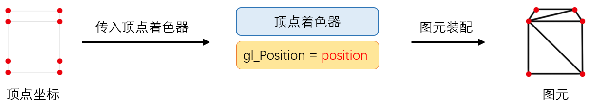
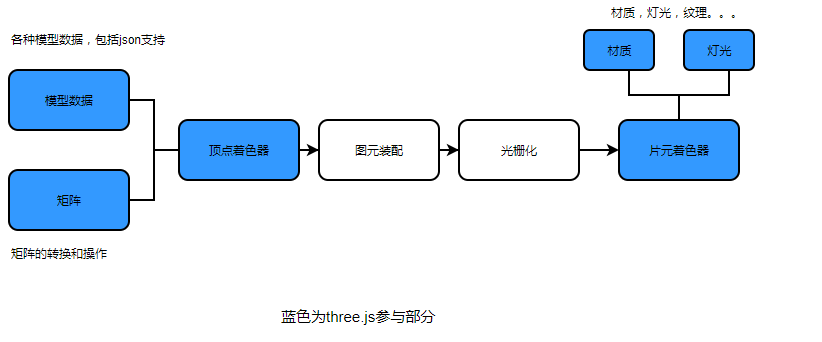

# 前端新视野- WebGL和three.js
## 前言
WebGL是一种3D绘图协议，这种绘图协议允许javascript和openGL结合起来。WebGL可以为canvas提供3d硬件加速（使用GPU在浏览器渲染3d模型和场景）。既然WebGL是openGL的一种实现，即可以在兼容的浏览器中进行3d渲染，由于浏览器的跨平台性，可以在多个设备多个平台展示3d效果。我们可以用WebGL做什么呢？
    
> 1. - 数据可视化
> 2. - ar vr
> 3. - 3d游戏动画等
在现代前端技术发展中，使用WebGL创建3d效果是一种不可获取的能力。由于webGL本身api是绘制最普通的点、线、三角形，所以为了绘制大型场景和模型，我们需要选用一些框架帮助开发，比如three.js。

## WebGL原理
WebGL为了渲染3d图像，需要建立图形管道，图形管道的步骤作用如下：


### Javascript
WebGL通过一系列图形接口，使我们可以通过js去使用GPU来进行图形渲染，呢么js做了什么功能呢？
- **初始化WebGL** 使用javascript初始化WebGL上下文对象
- **创建数组** 创建js数组用来保存几何数据
- **缓冲区对象** 缓冲区对象是指上传到GPU的二进制数据数组，创建缓冲区对象（定点,索引，位置，法线等）作为参数给数组
- **着色器**  使用js创建，编译，链接着色器（包括VBO和IBO）
- **Attributes** Attributes是指如何从缓冲区提供数据并且给VBO（顶点着色器）
- **Uniforms** 一致性变量可以认为是全局变量，也是通过js控制
- **变换矩阵** 通过js我们可以创建变换矩阵
### Vertex Shader
通过软件导出或者js定义，可以获取到3d图像的成千上万个顶点坐标，这些顶点坐标需要转化为图元需要顶点着色器处理并进行图元装配。顶点着色器在缓存区读取顶点坐标方便GPU更快读取。顶点着色器将三维世界坐标转换为屏幕坐标，存储在不同的gl_位置，当然也包括颜色、纹理坐标和一些与顶点关联的坐标点。这些数据被顶点着色器内置的Attributes变量引用，每一个Attributes变量指向被它读取的顶点着色器，所以有多少顶点，顶点着色器程序就会运行多少次。其中顶点着色器还包括Varying变量，这是顶点着色器和片元着色器传导数据用的。
### Primitive Assembly
图元装配简单来说就是让顶点转换为图元（三角形）的过程，这个过程我们是可控的：通过传入的顶点坐标和信息来构建图元，这也是可编程渲染管线的能力。



### Rasterization 
图元装配后形成一个个图元，只有骨架内部是空的，需要进行光栅化。光栅化阶段，会将基本图元转化为二维片元，光栅化相当于对图元进行填充。在光栅化过程中，可以对装配好的图元进行裁剪--保留完全在视锥体中的图元，丢弃完全不在视锥体中的图元，对部分在视锥体的图元可以自主选择正面或者反面剔除。


*光栅化*

### Fragment Shader
片元着色器会接受Varying变量和光栅化以后的值，这里的片元就是我们常说的像素，包含的操作有纹理映射和照明等。由于每个片元是独立运行的，所以这里也是图形管道对性能最敏感的地方，经过片元着色器以后，这些值会到帧缓冲区。
### Frame Buffer
帧缓冲区是渲染作业的最后结果，相当于屏幕所见内容。帧缓冲区包含深度缓冲和模板缓冲，可以在片元绘制之前对其过滤处理。


## Three.js
Three.js是对WebGL的API抽象化和封装化的js库，不必关心WebGL怎么渲染3d图形，并且在渲染中加入了各种优化，提高了性能。Three.js包含数学库，支持交互，扩展性强，还可以进行SVG,CSS3D等渲染，在WebGL不兼容的版本可以有回退解决方案。


- 辅助我们导出了模型数据,支持JSON，方便前端写数据模型;
- 自动生成了各种矩阵，支持对矩阵操作（移动，旋转，透视）和变换（模型矩阵-视图矩阵-投影矩阵）;
- 生成着色器;
- 方便生成自定义材质，雾化灯光纹理支持;
- 简化3d渲染细节，将3d场景拆为网格和内置对象种类

## 项目实践

在公开课的App中有勋章系统，类似于游戏中的成就系统，当你一些操作触发会颁发各式各样的3D勋章。由于ios和Android的机型和系统差别问题，我们采用WebGL做3d勋章的开发。
### 流程
采用UI提供的DAE模型，导入Three.js，在客户端生成勋章模型，通过Three.js加入灯光，加入canvas粒子效果，加入了手指滑动勋章后的惯性函数以及旋转角度会通过手机加速传感器变化，让整个悬浮勋章更加真实化流畅化。
 
 

 ### 解决难点
 
 > **ios和web端用Cinema 4D导出的dae文件纹理无法正常加载**
 - 多加入一个包含材质和纹理信息的mtl文件
 可以看到接口的返回:
 ``` js
 {
    // 兼容最早iOS原生使用的dae文件，已废弃
    image3D: "http://xxx.dae",
    // 材质文件
    image3DMaterial: "http://xxx.mtl",
    // gzip压缩过的模型文件
    image3DMoudle: "http://xxx.gz",
    // 已获得图片
    imageGot: "http://xxx.png",
    // 未获得图片
    imageNotget: "http://xxx.png"
}
 ```

> **生成模型文件较大，下载时间过长,并且cdn不支持gzip压缩**
-  出于体验优化,前端用nodejs写一个预压缩脚本，将dae和mtl文件压缩并上传到cdn同时同步更新到服务端的数据库中，解压通过webWorker多线程采用pako.js库进行gzip解压。

> **下载解析开销很大，并且3d模型占用内存过多**
- 目前产品需求是只有等级5的勋章，分两步优化：

    - 内存中只会存储最近5次的解析过的模型,当有新的模型要加入，通过LRU策略，对于最长时间没有使用的模型内存会释放。
    - 数据会存在IndexedDB，每次请求先从内存读取，内存中不存在从IndexedDB读取,都不存在走网络请求，并且会把新数据通过key-value存入IndexedDB 
    ```js
    // 尝试从临时缓存中读取模型
      if (models[currentMedalInfo.id]) {
        scene.add(models[currentMedalInfo.id]);
        modelsList.splice(modelsList.findIndex((id) => currentMedalInfo.id === id), 1);
        modelsList.push(currentMedalInfo.id);
        resolve();
        return;
      }

      let medalDataMap, medalDataCache, modelData, materialData;
      if (indexedDBSupport) {

        medalDataMap = await localforage.getItem('medalDataMap');
        medalDataMap = medalDataMap || {};
        medalDataCache = medalDataMap[currentMedalInfo.id];
        if (medalDataCache) {
          // 如果材质地址没变则直接从indexedDB读取,否则清理掉
          if (medalDataCache.image3DMaterial === materialUrl) {
            materialData = await localforage.getItem(materialUrl);
          } else {
            localforage.removeItem(medalDataCache.image3DMaterial);
          }
          // 模型同上
          if (medalDataCache.image3DMoudle === modelUrl) {
            modelData = await localforage.getItem(modelUrl);
          } else {
            localforage.removeItem(medalDataCache.image3DMoudle);
          }
        }
        // 储存最新的信息
        medalDataMap[currentMedalInfo.id] = currentMedalInfo;
        localforage.setItem('medalDataMap', medalDataMap);
      }

      // 如果不支持或indexedDB中没有则加载
      if (!materialData) {
        materialData = loadResource({ url: materialUrl });
      }
      if (!modelData) {
        modelData = loadResource({
          url: modelUrl, type: isDae ? 'text' : 'arraybuffer', onProgress: (progress) =>{
            progressCB(progress.loaded / progress.total * (isDae ? 100 : 80));
          }
        });
      }
    ```
> **有些机型对WebGL支持不好,模型加载失败**
-  采用图片来做优雅降级，当做勋章处理。


## 小结
这些年，BI、大数据平台蓬勃发展，对html5的需求也越来越多。很多产品已经采用WebGL的功能来做3d效果和场景，在各大浏览器厂商和技术人员的努力，使类似Three.js这样优秀的WebGL功能越来越完善，开发难度降低许多。在项目实践中，用Three.js的WebGL开发出来的3d效果流畅炫酷，是一种比较优秀的新选择。