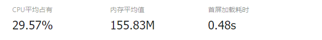

# 百度小程序优化

## 体验优化
- **滚动** ：在百度小程序中，锚点定位的滚动效果要使用<scroll-view></scroll-view>通过固定的高度来滚动距离，对于固定个数的分类页面是不友好的，修改成为简单的页面滑动。
- **下拉刷新，上拉加载**： 能用原生用原生是能保证最好的性能。上拉加载问题不大，百度小程序本身提供onReachBottom事件，可以通过在pages.json设置阈值，通过搭配css3特效保持与app一样的体验；下拉刷新原生同样提供事件-onPullDownRefresh，但是有个问题，在ios中顶部tabbar采用position:fixed定位会有抖动现象（当下拉松手慢，特别明显），ios用户体验一般。第一次解决是用uni框架中的mescroll插件，用前端方式接手过来下拉刷新，倒是没有抖动现象，也可以自定义修改下拉刷新的动画（如果采用uni-app安装，需要手动修改源代码）。但是这是在监听onpagescroll，在配置不高（其实iphone6 plus都很明显）手机滚动会有卡顿现象，即使调高参数fps效果也没有完美。尝试了position不常用的属性
```js
 position: sticky
```
效果很好，在ios上没有抖动了。
## 加载优化
简单来说，我们业务在百度小程序中大概分为4个模块： 推荐列表，普通列表，分类列表和课程详情。

优化分为3个方面：

- **loading** 本身采用loading图来展示加载效果，但是tabbar切换还有接口请求都会有loading图，会造成闪过现象，用户感官不友好（昨天看了一篇文章是react的suspense 来解决组件懒加载的loading，后边可以实现vue版本），感觉页面很乱。选用了骨架屏操作，在我们app上是采用简单的背景图然后替换获取到的图片，在小程序为了提高性能，才用了css的样式代替图片骨架屏


- **图片加载**  列表展示肯定是图配文案，呢么加载优化重点是在图片上。图片加载通过获取url然后src赋值最后到onload是挺消耗网络资源的。优化方向一般是采用cdn（但是老接口返回的是不支持cdn的）和图片大小处理。正好我们的云服务支持图片处理，选择裁剪固定大小和清晰度80(完全不影响用户体验)，有些1MB的图片可以优化到12KB左右，加载速度提升很多。
-  **prefetch** 用于设置预请求的所有url的列表，该部分URL，会在进入小程序后自动发起请求(优于开发者代码加载)。当开发者再次发起request请求时可以增加cache参数，如果配置的prefetch请求已返回，则会直接返回请求结果，如果配置的prefetch请求还未返回，则当次request会继续之前未发送完成的request请求。小程序提供的预请求方式有缺点，目前暂时不支持动态参数（已反馈给官方，百度相关开发准备强化）。
-  **网络优化** 这部分其实可以理解为优雅降级，针对不同的网络有不一样的变化，比如无网的加载图片（与app同步），视频切换网络的提示和清晰度。

## 代码优化
- 小程序的开发也是通过数据驱动的，用小程序原生开发中，使用setData来同步展示。对于新手开发，很可能写出大量setData造成性能低下或者白屏时间过长。首次开发百度小程序，也为了以后迁移微信，支付宝小程序方便，在技术选型上，选择了taro和uni两个小程序框架。taro是react栈的（项目组没有用react的，会对后期其他人维护产生学习成本），加上uni对比渲染速度最快（也是vue官方推荐的小程序框架），我们选择了uni。
[框架对比测评](https://juejin.im/post/5ca1736af265da30ae314248)
- uni采用vue这种spa方式，为了减少白屏时间，对于关键数据采用提前请求，非关键数据采用延时请求（通过tab切换触发和下一个周期请求相结合）。uni本身对setData做了优化，可以直接使用。
- 自定义组件的异步加载
## 优化对比

- 优化前

- 优化后
